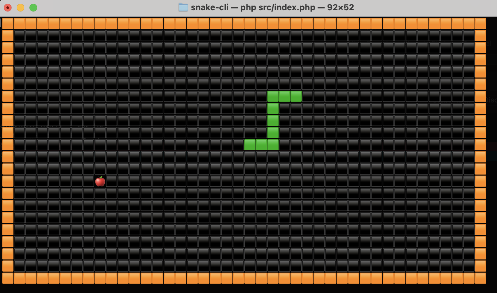

# Snake CLI

Play Snake in your terminal!

## Requirements

PHP 8.1 - you can install it on macOS via Homebrew with:

```bash
brew install php@8.1
```

Composer: you can find instructions on how to install it at https://getcomposer.org

## Install

Clone the repo and install the dependencies

```bash
composer install
```

## Play

From your terminal, execute:

```bash
php index.php
```

### Commands

- `w` move the snake up
- `a` move the snake left
- `s` move the snake down
- `d` move the snake right
- `p` pause the game
- `r` resume the game
- `q` quit the game

You must press `ENTER` after every command
